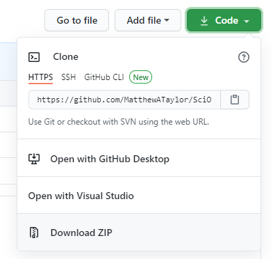
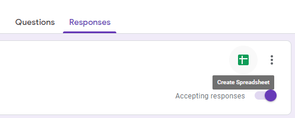
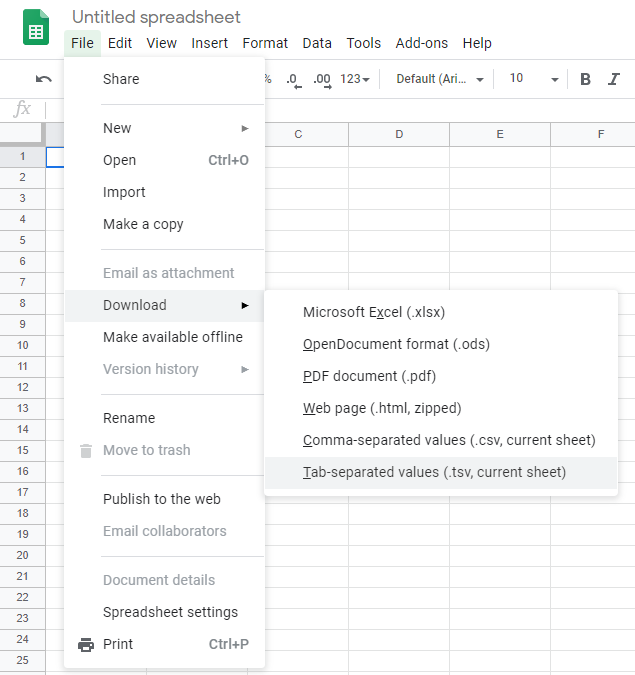

# SciOly Sort
A program for sorting Science Olympiad students into events

## Getting started
1. Download this project by clicking Code > Download ZIP:



2. Unzip the downloaded folder.
    * For Windows: Right click the folder and press "Extract All..." to extract the project's files.
3. Open the unzipped folder and navigate to the "src" folder.
4. Open "index.html" to use the program.

## Data Used for Sorting
### Sorting requires three TSV files:
* Event list (Google Sheets > TSV)
    * Name of each event
    * Maximum number of students in each event
    * Practice schedule block
* Registration data (Google Forms > Google Sheets > TSV)
    * Student grades
    * Student event preferences
    * Whether or not parents will be team volunteers
* Placement test data (Google Forms > Google Sheets > TSV)
    * Student placement test scores

### Samples
* [Event list](https://docs.google.com/spreadsheets/d/1T2gawd6Jf1twdE8PftVOxGwr4_BKuDXxM5ly_szexaw/edit?usp=sharing)
* [Registration data form](https://docs.google.com/forms/d/18byww3zlSliWNiFpndowJALzkFHEfmMLGE7Af-vlcqs/copy)
* [Placement test form](https://docs.google.com/forms/d/1m3efgH5zuZ0casWrq7-uYRyV6iQgXG1o8wQDGcBSL04/copy)

### How can I create a Google Sheets spreadsheet containing responses to a Google Form?
Responses > Create Spreadsheet



### How can I download a TSV file from a Google Sheets spreadsheet?
File > Download > Tab-separated values



## Sorting Parameters
* Placement test score weight (how much to take placement test score into account)
* Parent mentor weight (how much to take parent mentors into account)
* Maximum number of events per student
* Maximum proportion of students from each grade per event

## How Sorting Works
```
Sort all students by placement test score and parent mentors
For each student:
    Sort all events by preferences
    For each event:
        If no conflicts with event:
            Assign event to student
```